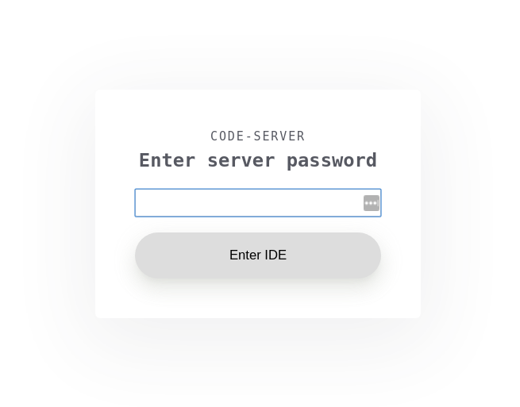
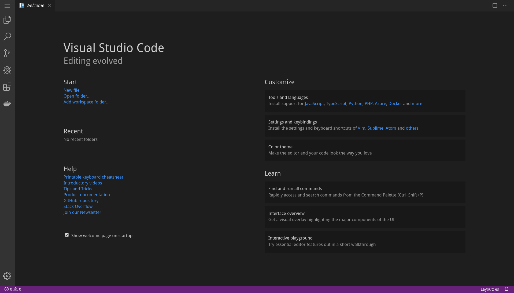

# VS Code-server
Run VS Code on Kubernetes as Pods with tools and access to the cluster

## Running VS Code on a Docker host
### Building the container

If you want to push the Docker image to the Docker hub registry, edit the file docker.build.sh and change the organization from Praqma to one you have access to. Then simply run the script

```
./docker.build.sh

Sending build context to Docker daemon  8.192kB
Step 1/14 : FROM codercom/code-server:2.1692-vsc1.39.2
 ---> 5ace6cdc3088
Step 2/14 : USER root
 ---> Using cache
 ---> cb4fc5426553
Step 3/14 : RUN apt-get update &&     apt-get install -y --no-install-recommends         git         curl         nano         docker.io         npm         bsdtar &&     apt-get clean
 ---> Using cache
 ---> 800812299bef
Step 4/14 : ENV K8S_VERSION=v1.16.2
 ---> Using cache
 ---> e4e4becc8abd
Step 5/14 : RUN curl -sSL https://dl.k8s.io/release/${K8S_VERSION}/bin/linux/amd64/kubectl > /usr/local/bin/kubectl &&     chmod +x /usr/local/bin/kubectl
 ---> Using cache
 ---> 8ef1da0cdd66
Step 6/14 : ENV HELM_HOME=/root/.helm
 ---> Using cache
 ---> f2f37e5dc48b
Step 7/14 : ENV HELM_VERSION=v3.0.0-beta.5
 ---> Using cache
 ---> f82f4ac1a856
Step 8/14 : RUN curl -sSL https://get.helm.sh/helm-${HELM_VERSION}-linux-amd64.tar.gz | sudo tar -xz -C /usr/local/bin linux-amd64/helm --strip-components=1
 ---> Using cache
 ---> 330219f008a1
Step 9/14 : USER coder
 ---> Using cache
 ---> 479493f72659
Step 10/14 : ENV EXTENSIONS="redhat.vscode-yaml PeterJausovec.vscode-docker"
 ---> Using cache
 ---> 690737f5d129
Step 11/14 : RUN for ext in ${EXTENSIONS}; do code-server --install-extension ${ext} &&     (cd /home/coder/.local/share/code-server/extensions/${ext}*/ &&     npm install || echo "ignore possible errors"); done
 ---> Using cache
 ---> ca327e1a8fb9
Step 12/14 : COPY --chown=coder:coder entrypoint.sh /
 ---> Using cache
 ---> dffce221b6b0
Step 13/14 : COPY --chown=coder:coder settings.json /home/coder/.local/share/code-server/User/settings.json
 ---> Using cache
 ---> 6915fb196976
Step 14/14 : ENTRYPOINT ["dumb-init", "/entrypoint.sh"]
 ---> Using cache
 ---> d49bda78680f
Successfully built d49bda78680f
Successfully tagged praqma/vscode:1.39.2

```

### Running the container on a Docker host

Before running the container, edit the ```file docker.run.sh``` and change ```GIT_REPO``` to a repository you want cloned, ```PASSWORD``` to a password of your choice, ```CODE_PORT``` to the port you want VS Code to run on. Then run the start script:

```
./docker.run.sh
```

Open a browser and point it to localhost:[the port you chose]. If you didn't change anything, that would be localhost:5050

You will be met with a screen asking for a password:


If you didn't change the password in ```docker.run.sh``` simply type ```praqma``` and hit ```Enter IDE```.

You should now see the VS Code  like this:



## Deploying to Kubernetes
### Editing the YAML
#### Namespace
If you want to use a different namespace then workshopctl, then edit all files and change that field.

#### Ingress
First we need to edit the YAML. Start by editing the ```k8s-deploy/ingress.yaml```. Change the host field under rules to the url you want. I'm using MetalLB and Traefik with nip.io. If you dont have a DNS to point to the service, simply change the IP in the current hostname to the IP that is you Ingress controller. Then nip.io will resolve it to that.

#### Password
The password for VS Code is stored in a secret. Edit the file ```k0s-deploy/secret.yaml``` and change to password to whatever you want. Remember, it needs to be base64 encoded:

```
echo -n "new_Password" | base64
```

#### Deploy to Kubernetes
Now apply the YAML by running the script from the top folder.

```
./kubectl.apply.sh
```

Now open a browser and go to the url specified in the ```k8s-deploy/ingress.yaml``` file.


